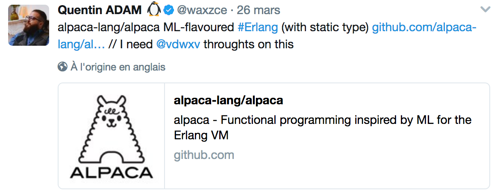

% Laissons le **Lama** cra(*s|c*)her, \newline à la découverte du langage **Alpaca** 
% Xavier Van de Woestyne \newline __DernierCri__
% {width="50px"} \newline __LilleFP4__ - 04 Mai 2017

# Moi-même :v 

-  [**@vdwxv**](https://twitter.com/vdwxv) sur Twitter, [**@xvw**](https://github.com/xvw) sur Github ;
-  j'ai un site web tout pourri (https://xvw.github.io)
-  Erlang, [**OCaml**](http://ocaml.org/), [Elixir](http://elixir-lang.org/), [Ruby](https://www.ruby-lang.org/fr/) (et depuis peu... [Clojure](https://clojure.org/)) etc. ;
-  Développeur à [**DernierCri**](https://derniercri.io/) ;
-  je suis **Belge** (donc je n'ai pas voté **Macron** :D).

> Si vous avez un talk, n'hésitez pas à nous (LilleFP) le proposer ! On est open !

-  j'aime, à mon grand malheur, dire du mal (gratuitement) des 
   technologies que je n'aime pas... désolé (pour les gens que j'ai pu 
   froisser dans le passé)

# Sommaire 

Rapidement, **Alpaca** est un nouveau langage, inspiré de **ML**, sur la **VM de Erlang**.

- Introduction : **Erlang** as a VM (Elixir, LFE, Reia etc.)
- Caractéristiques de **Alpaca**, présentations et thématiques
- Pourquoi Erlang n'est **pas** typé, viabilité du projet
- Conclusion + questions/réponses

> Ceci est un talk **interactif**, n'hésitez pas à m'interrompre en cas d'ambiguïté, de 
> dépit, ou de joie !

# Erlang

> Erlang est un langage de programmation, supportant plusieurs paradigmes : concurrent, temps réel, distribué. Son cœur séquentiel est un langage fonctionnel à évaluation stricte, affectation unique, au typage dynamique fort.

---

-  1986 chez **Ericsson**, libéré en 1998 ;
-  première implémentation dans l'excellent **Prolog** (et inspiration syntaxique) ;
-  articulé autour du modèle **Acteur** (de Carl Hewitt) ;
-  fonctionne sur une VM, **JAM**, ensuite **BEAM**.

> Un des rares langages où la syntaxe pouvait réellement poser un problème.

# BEAM : Bogdan/Björn's Erlang Abstract Machine

-  Implémentation manuelle de processus légers ;
-  utilise un glâneur de cellules ;
-  tolérante aux pannes ; 
-  distribuable _relativement_ facilement ;
-  Beaucoup de *success-stories* :
     -  Ericsson ;
     -  Facebook ; 
     -  WhatsApp ;
     -  CouchDB, Riak, RabbitMQ ;
     -  etc.

# BEAM, concrètement

-  Une machine virtuelle pour exécuter du Erlang (mais pas que !) ;
-  une interface de communication (**Ports** et **NIF's**) ;
-  un écosystème **riche** (**OTP** et ses **BIF's**) ;
-  un outillage solide pour permettre : 
     - La **concurrence** légère, _massivement_ ; 
     - la communication **asynchrone** ; 
     - l'isolation des processus ; 
     - la propagation d'erreurs ; 
     - l'évolution continue de systèmes ; 
     - **Distribuable par machine et par unité de calcul**
     - être **temps-réel-souple**.

---

Concrètement, Erlang et BEAM permettent de faciliter le développement 
d'applications à haute disponibilité, distribuables + _blabla promotionnel_.

## En fait ...
Erlang... c'est un peu comme **Go** ... 
[PREUVE (c'est un lien)](https://derniercri.io/tech-blog/concurrence-go-erlang)

---

> Si BEAM et Erlang tabassent autant, pourquoi avoir dû attendre 2012 pour avoir, enfin, 
> un langage avec une syntaxe plus moderne (et moins déroutante) ?

---

-  Pas de formalisation pour le langage ;
-  pas de formalisation pour ERTS (Erlang RunTime System).

## Ce qui implique : 
Les gens désirant créer un langage sur BEAM doivent dériver la sémantique de la VM...
fastidieux.

# Pourtant certains s'y sont essayés 

-  **Joxa** : le Clojure (:troll:) de BEAM ; 
-  **LFE** :  le Clojure de ..., l'exercice de parsing qui a évolué ;
-  **Efene** : le Python de BEAM ; 
-  **Reia** : le Elixir de BEAM ; 
-  **Elixir** : le Reia de BEAM ;
-  **EML** : le OCaml de BEAM ;
-  **MLFE/Alpaca** : le EML de BEAM.
-  et bien d'autres ...

Aujourd'hui, on s'intéresse à **Alpaca**

# Pourquoi cette présentation ?

# Sommaire de la présentation d'Alpaca 

> Ce sera relativement rapide ! 

- Genèse du projet et motivations ;
- Processus de compilation ;
- syntaxe générale ; 
- système de type (ADT's + *row-polymoprhism*) ;
- interopérabilité avec BEAM ; 
- typage des messages.

<!-- ---

{width="350px"}

--- -->