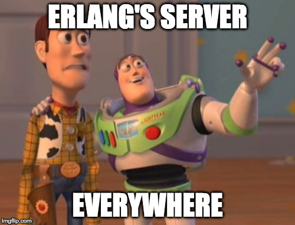

% Yaws : Yet Another Web Server
% Xavier Van de Woestyne ~ @derniercriio
% `(Lille |> Elixir) 3`

# WHOAMI

-  **@vdwxv** sur Twitter, **@xvw** sur Github ;
-  Erlang, OCaml, Elixir, Ruby etc. ;
-  Développeur à **Dernier Cri** ;
-  *LilleFP*.

---

> Qui a de l'expérience dans le tuning de **BEAM** et de **OTP** et du *Lexer* **Erlang** ?

---

{width=390px}

---

# Sommaire

-  **Erlang** et le web (Cowboy + blablabla) ;
-  présentation formelle de Yaws ;
-  applications structurées avec modernité et **Appmode** ;
-  et dans le futur ;
-  conclusion.

# "Erlang is the DSL for writing (web) servers" \newline @pavlobaron

- Concurrent ;
- la VM peut transformer les interactions avec des sockets en envois de messages ;
- `gen_(...)` et `inets`.

> On peut imaginer écrire un serveur en ~40 lignes de codes.

# Et comment tenir la montée en charge ?

-  `gen_server`
-  `supervisor`
-  `application` (pour la *bogossitude*)

> C'est tellement simple qu'il existe des *milliers* de serveurs (web) sur les internets !

---

- Elli ;
- Cowboy ;
- Yaws ;
- MochiWeb ;
- Misultin ;
- ...

{width=200px}

# Cowboy, le choix de Phoenix !

En vrai, Cowboy n'est **pas** un serveur HTTP(s) ...

- Bibliothèque *Low-level* ;
- discutablement composable ;
- très efficace ;
- facile à prendre en main.

> C'était un choix qui s'inscrivait vraiment bien dans la *vibe* de **Phoenix** !

# Les apports de Cowboy dans le monde Erlang

-  Une culture de la bibliothèque spécialisée ;
-  une véritable culture de l'usage des *high-order-function* (sans troll) ;
-  de l'agilité (facile à maintenir et tout) !
